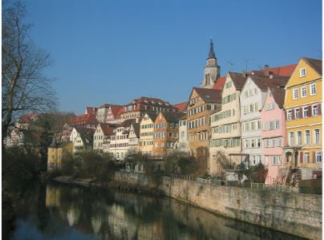
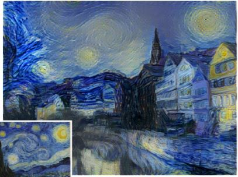

# StyleTransfer
A machine learning method to transfer style of artwork.

# Overview
This project takes one image's style and transfers it to another image's content. For example:

#### Style image

#### Content image

#### Transferred image

Given an <a href="https://arxiv.org/pdf/1508.06576.pdf">academic paper</a> I created a machine learning process to ask the user for two images, one for content the other for style. I then fed these images into a pretrained <a href="https://neurohive.io/en/popular-networks/vgg16/">VGG network</a>, saving certain layer outputs depending if the input image was the style or content image. I then took a fresh content image, fed it through a vgg network which cached all the network layer outputs, and used these saved layer outputs to minimize with the previously saved style and content layer outputs. By minimizing the style and content layer losses, the fresh content image slowly approached a hybrid of these two images, making the style more and more like the style image and the content more and more like the content image. In order to save specified layer outputs from the VGG netwokr I had to create a custom VGG wrapper which received as input a list of layers to track and returned a vgg network which would produce a cache system of the layers specified.

### Methods
See [StyleTransfer.ipynb](StyleTransfer.ipynb).
